The content below is an example project proposal / requirements document. Replace the text below the lines marked "__TODO__" with details specific to your project. Remove the "TODO" lines.

(___TODO__: your project name_)

# PlanPal 

## Overview
Lesson planning is a never-ending process for teachers. Between grading, teaching, and trying to maintain a personal life, it can be tough to stay organized. Week after week, planning lessons can become overwhelming to manage.

That’s where **PlanPal** comes in! PlanPal is a web app that helps teachers create, submit, and keep track of all their lesson plans in one place. It reminds teachers of the standards each lesson must meet, and provides easy access to linked materials like activities, slides, and worksheets. The app also sends notifications about planning deadlines and streamlines the approval process with supervisors all in one unified platform.


## Data Model

The application will store Users and Lesson Plans.
* Users can have multiple lesson plans (via references).
* Lesson plans belong to a single user (teacher) and can store information about materials, standards, due dates, and supervisor feedback.
* Supervisor will have the ability to provide feedback, approve, or decline the Lesson plans


(___TODO__: sample documents_)

An Example User:

```javascript
{
  "username": "mrsmith",
  "hash": "/* password hash */",
  "role": "", //Supervisor or teacher
  "lessonPlans": [] // Supervisors don't own lesson plans, they only review them
}
```

An Example List with Embedded Items:

```javascript
{
  "user": /* reference to teacher User */,
  "teacherName": "Mr. Lopez",
  "title": "Exploring Plant Life Cycles",
  "grade": "4th Grade",
  "subject": "Science",
  "period": "Period 3",
  "dateTeaching": "2025-11-10",
  "learningObjective": "Students will be able to describe the stages of a plant's life cycle.",
  "learningStandard": "NGSS.4.LS1.1",
  "introduction": "Start with a short video about how seeds grow into plants.",
  "activities": "Students will observe and label parts of a real plant.",
  "closing": "Class discussion and reflection journal entry.",
  "notes": "",
  "approved": false,
  "status": "pending_supervisor",
  "createdAt": "2025-10-29T12:00:00Z"
}
```


## [Link to Commented First Draft Schema](db.js) 

## Wireframes

/login - page for showing login screen

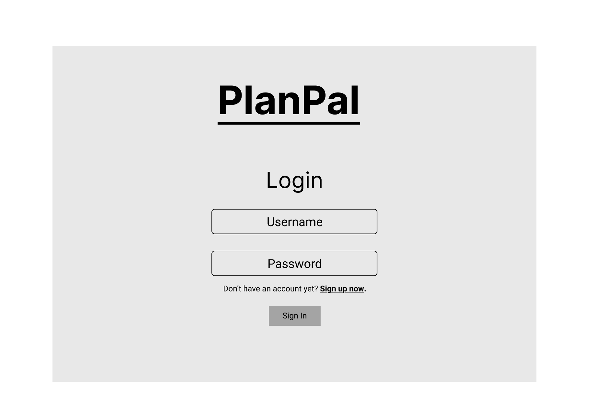

/register - page for showing registering user screen

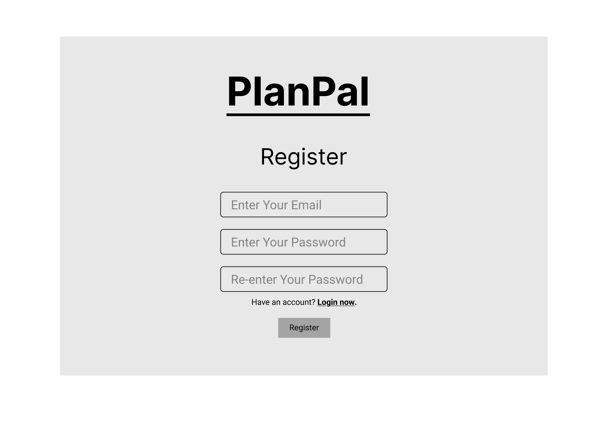

/setup - page for showing user set up account screen

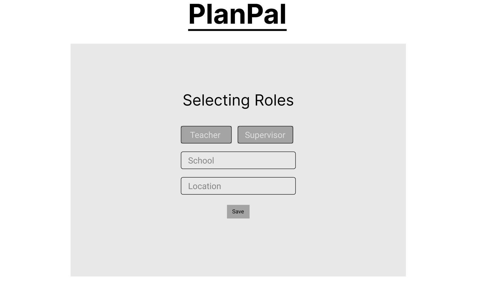

/supervisor/home - page for supervisor homepage

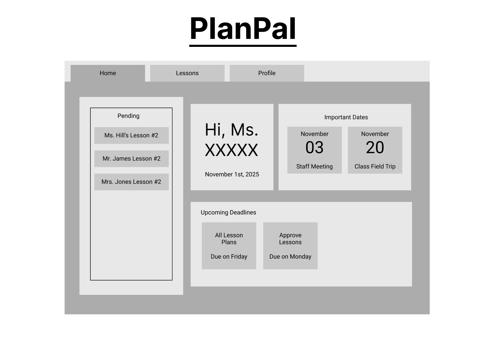

/supervisor/view - page for viewing all supervisor lesson plans

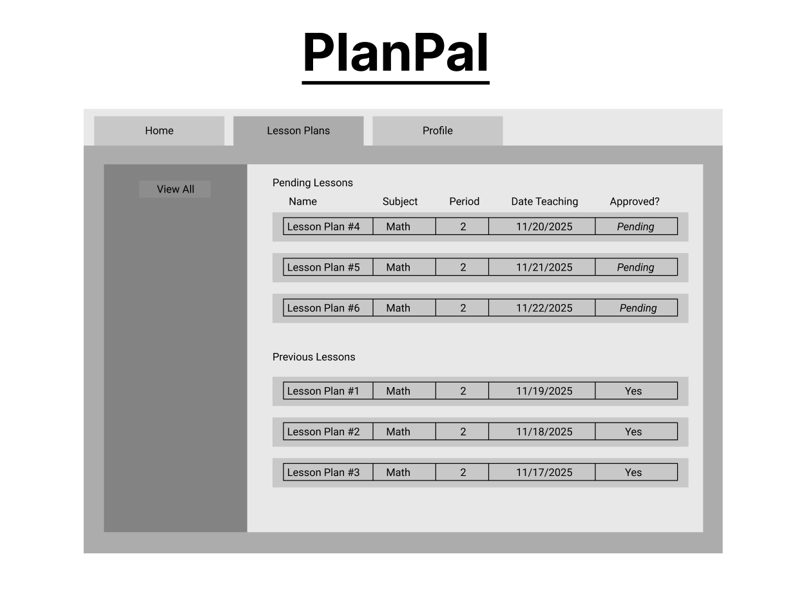

/supervisor/view/slug - page for viewing a specific supervisor lesson

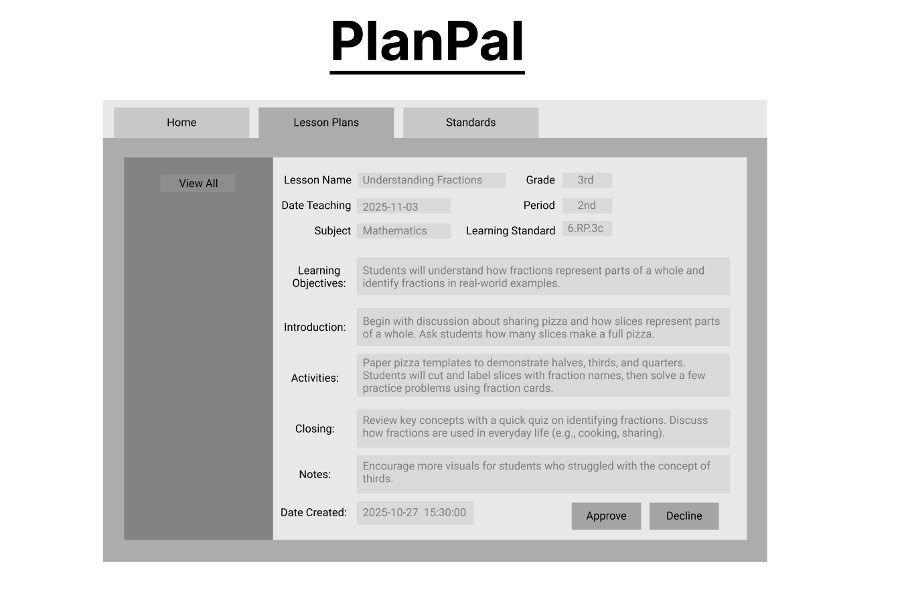

/supervisor/profile - page for viewing supervisor profile

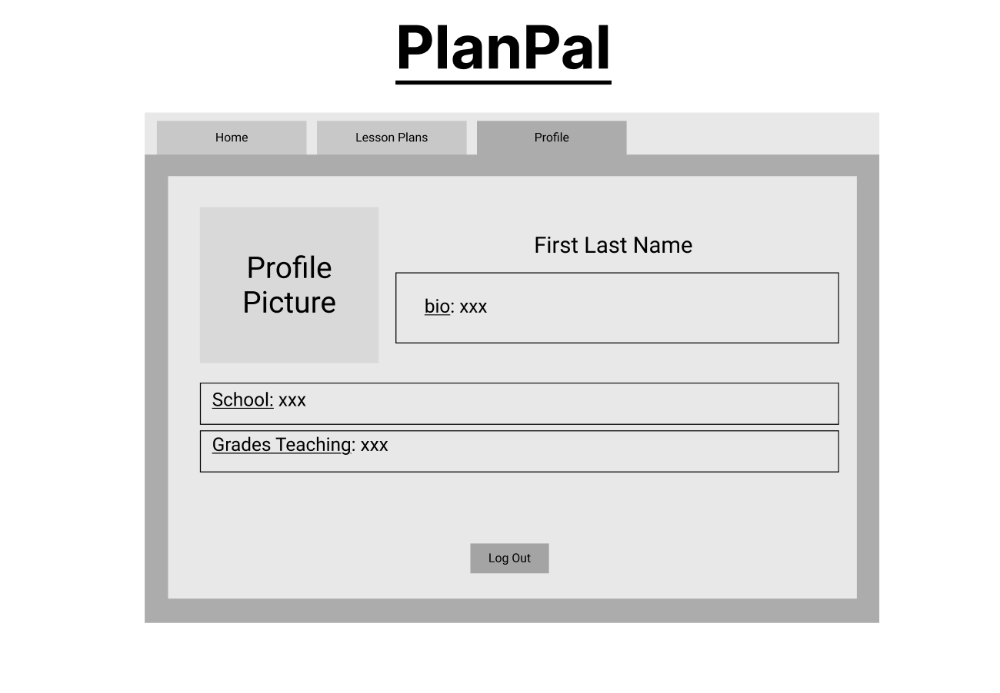

/teacher/home - page for viewing a teacher's homepage 

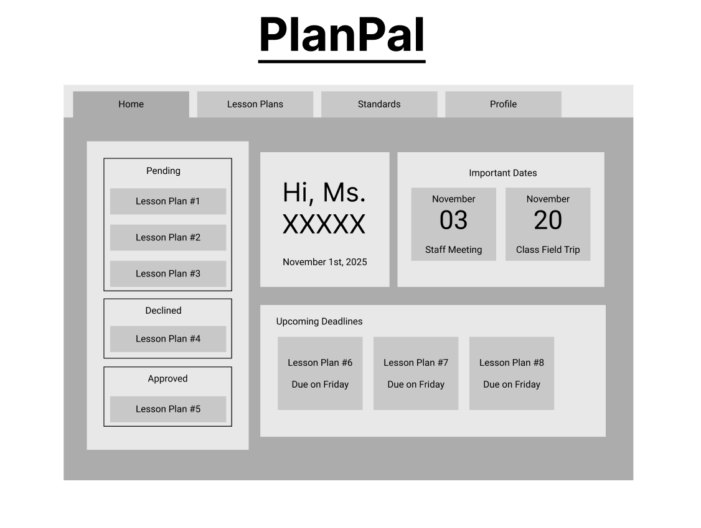

/teacher/view - page for viewing all teacher's lesson plans

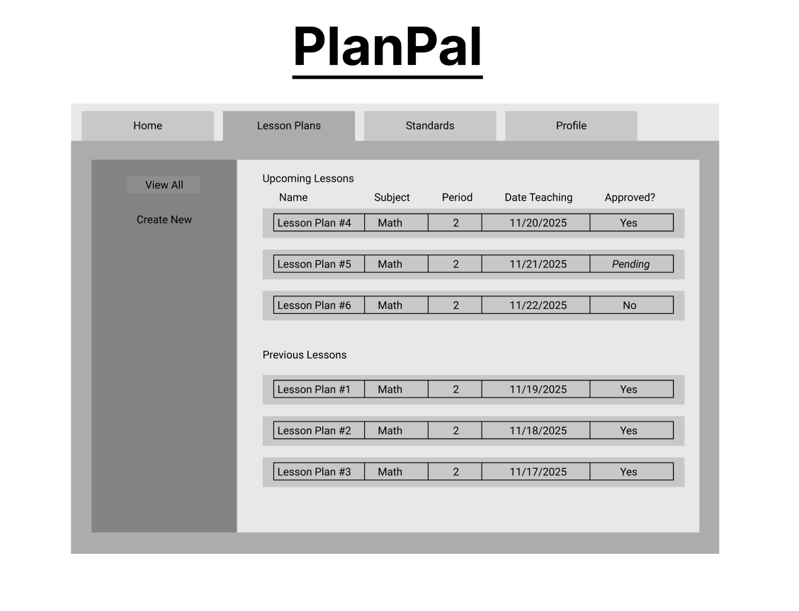

/teacher/view/create - page for viewing all teacher's lesson plans

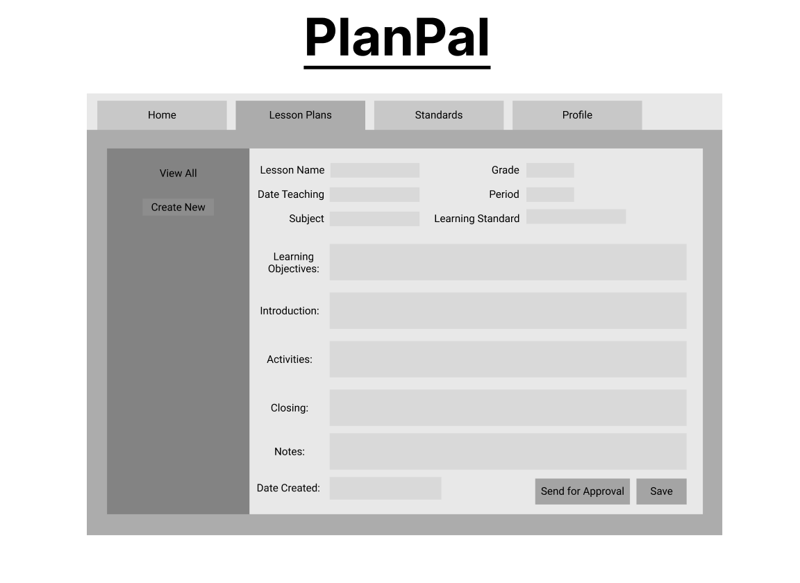

/teacher/view/slug - page for viewing one teacher's lesson plans

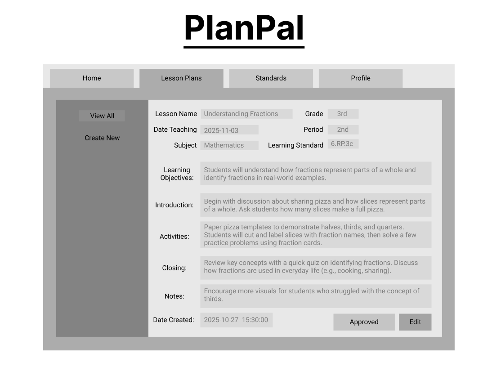

/teacher/standards - page for viewing all teacher's standards

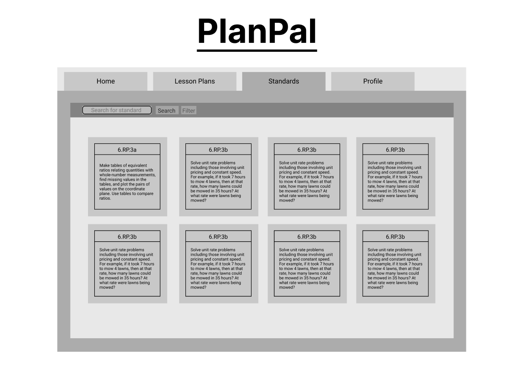

/teacher/profile - page for viewing teacher's profile

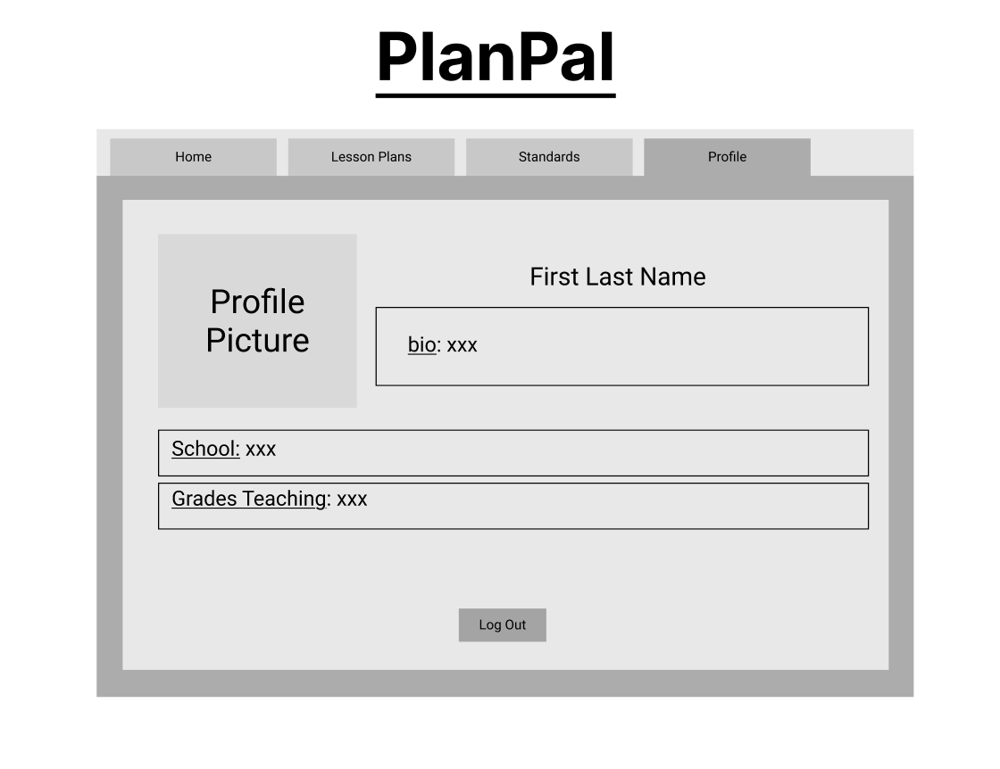


## Site map

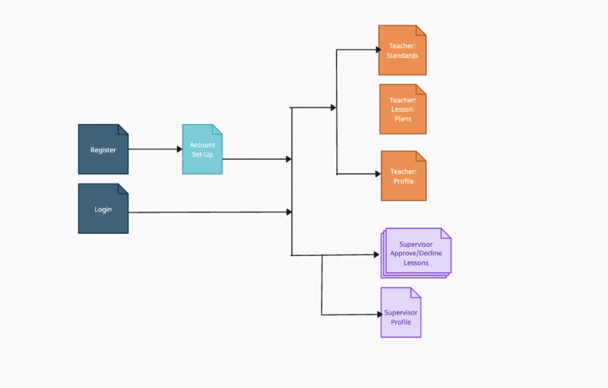

## User Stories or Use Cases

1. As a teacher, I want to create and log into my account, so that I can securely access my lesson plans.
2. As a teacher, I want to edit my profile information, so that I can keep my account details up to date.
3. As a teacher, I want to create new lesson plans by filling out details such as title, grade, subject, objectives, and activities, so that I can organize and prepare my classroom materials.
4. As a teacher, I want to attach learning standards and materials to each lesson plan, so that I can align my lessons with required guidelines.
5. As a teacher, I want to view all my submitted lesson plans, so that I can review my past and upcoming lessons.
6. As a teacher, I want to see the approval status (pending, approved, declined) of my lesson plans, so that I know which ones need updates.
7. As a teacher, I want to edit and resubmit declined lesson plans, so that I can make corrections based on supervisor feedback.
8. As a teacher, I want to read feedback or notes left by my supervisor, so that I can improve my lesson plans.
9. As a teacher, I want to be notified when my lesson plan is approved or declined, so that I can respond in a timely manner.
10. As a supervisor, I want to log into my account, so that I can review lesson plans submitted by teachers.
11. As a supervisor, I want to view and update my profile information, so that my contact and professional details stay accurate.
12. As a supervisor, I want to view all lesson plans submitted by teachers, so that I can evaluate their content.
13. As a supervisor, I want to filter lesson plans by approval status (pending, approved, declined), so that I can manage reviews efficiently.
14. As a supervisor, I want to approve or decline lesson plans, so that I can maintain teaching quality standards.
15. As a supervisor, I want to add notes or feedback when declining a lesson plan, so that teachers understand what needs to be improved.
16. As a supervisor, I want to mark lesson plans as approved, so that teachers know they’re ready for use in class.

## Research Topics

(___TODO__: the research topics that you're planning on working on along with their point values... and the total points of research topics listed_)

* (5 points) Integrate user authentication
    * I'm going to be using passport for user authentication
    * And account has been made for testing; I'll email you the password
    * see <code>cs.nyu.edu/~jversoza/ait-final/register</code> for register page
    * see <code>cs.nyu.edu/~jversoza/ait-final/login</code> for login page
* (4 points) Perform client side form validation using a JavaScript library
    * see <code>cs.nyu.edu/~jversoza/ait-final/my-form</code>
    * if you put in a number that's greater than 5, an error message will appear in the dom
* (5 points) vue.js
    * used vue.js as the frontend framework; it's a challenging library to learn, so I've assigned it 5 points

10 points total out of 8 required points (___TODO__: addtional points will __not__ count for extra credit_)


## [Link to Initial Main Project File](app.js) 

(___TODO__: create a skeleton Express application with a package.json, app.js, views folder, etc. ... and link to your initial app.js_)

## Annotations / References Used

(___TODO__: list any tutorials/references/etc. that you've based your code off of_)

1. [passport.js authentication docs](http://passportjs.org/docs) - (add link to source code that was based on this)
2. [tutorial on vue.js](https://vuejs.org/v2/guide/) - (add link to source code that was based on this)
